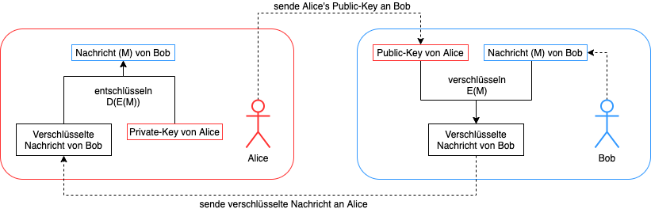

---
title: "Kryptowährungen"
author: "Peter Giger"
date: 
page-background: "background.pdf"
reference-section-title: "References"
...

# Links

[Slides](slides.html){ width=150px }

# Lernziele

>
- Sie können den Namen und ungefähren Wert von mind. 2 verschiedenen Kryptowährungen auswendig aufzählen.
- Sie können ein Beispiel einer Transaktion anhand eines vorgegebenen Falles aufzeichnen.
- Sie kennen das "Double Spending Problem" und können es anhand eines Beispiels in eigenen Worten beschreiben.
- Sie kennen die wichtigsten Eigenschaften einer kryptografischen Hashfunktion und verstehen, wieso diese in der Informatik nützlich ist.
- Sie verstehen, wie der Proof-of-Work funktioniert und für was er verwendet wird.
- Sie verstehen das Prinzip der Public-Key Kryptografie, warum die digitale Signatur für Kryptowährungen essenziell ist und können hypothetische Beispiele anhand eines vorgegebenen (mathematischen) Beispiels berechnen. 

# Was ist eine Kryptowährung?
Die Definition laut Wikipedia [@wikipedia2021kryptowährung]:

> Eine Kryptowährung ist ein **digitaler Vermögenswert**, der auch als Tauschmittel fungiert. Einzelne Vermögenszuschreibungen sind dabei in einer **dezentralen Datenbank** (Distributed-Ledger-Technologie), in der Regel einer **Blockchain**, festgehalten. Diese öffentliche Finanztransaktionsdatenbank verwendet starke **Kryptographie**, um die **Transaktionen** und Besitztümer und gegebenenfalls die Erschaffung von weiteren Coins oder auch die Vernichtung von Coins zu verifizieren und zu sichern.

Einfach gesagt: Eine Kryptowährung ist "**Digitales Geld**", das **ohne Intermediär** (z. B. Banken) auskommt. Die Sicherheit wird durch **kryptografische Methoden** (z. B. Verschlüsselung) sichergestellt. Die erste und wohl bekannteste Kryptowährung ist Bitcoin [@nakamoto2012bitcoin]. Diese wurde von Satoshi Nakamoto (Pseudonym) entwickelt und 2008 als White Paper veröffentlicht. 

**Aufgabe:** Zählen sie 3 verschiedene Kryptowährungen auf inkl. deren Wert in CHF (aktuell, vor einem Monat und vor einem Jahr). Was ist dabei auffällig (Stichwort: Volatilität)? Welche Faktoren beeinflussen den Wert von Kryptowährungen?
<!---
Lösung:
Bitcoin: 45000, 35000, 10000
Ethereum: 3000, 2000, 500
Dogecoin: 0.29, 0.19, 0.0002
-> Faktoren: Angebot/Nachfrage, Produktionskosten (Mining), Twitter, Vorschriften, News/Twitter...
--->

\TextField[name=T1, multiline=true, height=5\baselineskip, width=\hsize, bordercolor={0 0 0}]{}

\newpage
# Zentrale vs. dezentrale Datenbank

Traditionell sind Banken für den Schutz unseres Geldes zuständig. Wenn wir etwas online kaufen, prüfen sie, ob genug Geld vorhanden ist und führen dann die Transaktion durch. Als Beispiel: Alice hat von Bob ein iPhone gekauft und überweist 1000.- auf sein Konto. Eine Transaktion könnte wie folgt aussehen:

{ height=150px }

| Betrag | Von | An |
|---|---|---|
| 1000.- | Alice | Bob |

Table: Datenbank des Intermediärs

Diese Transaktion wird in einer zentralen Datenbank gesichert. Die Bank stellt als vertrauenswürdiger Intermediär sicher, dass alles "richtig" läuft. Bitcoin und andere Kryptowährungen sind hingegen dezentral, d.h. die Transaktion erfolgt direkt von Person zu Person (peer-to-peer) und wird von jeder einzelnen Person gesichert und überprüft [@nakamoto2012bitcoin]. Als Vergleich: Kryptowährungen sind das Bargeld der digitalen Welt. Angeknüpft am vorherigen Beispiel werden die Transaktionen verteilt (dezentral) gesichert:

{ height=150px }

| Betrag | Von | An |
|---|---|---|
| 1000.- | Alice | Bob |

Table: Datenbank von Alice

| Betrag | Von | An |
|---|---|---|
| 1000.- | Alice | Bob |

Table: Datenbank von Bob

**Aufgabe:** Erstellen sie eine Transaktionstabelle für folgendes Beispiel: Alice überweist Charlie 200.-, Bob überweist Alice 300.- und Charlie überweist Bob 100.-.
<!---
Lösung:
| Betrag | Von      | An        |
|--------|----------|-----------|
| 200.-  | Alice    | Charlie   |
| 300.-  | Bob      | Alice     |
| 100.-  | Charlie  | Bob       |
--->

\TextField[name=T2, multiline=true, height=6\baselineskip, width=\hsize, bordercolor={0 0 0}]{}

\newpage
# Double-Spending Problem

Wie sie vielleicht bereits bemerkt haben, gibt es ein grosses Problem bei dezentralen Datenbanken. Jeder und jede kann die Datenbank nach Belieben ändern. Als Beispiel könnte Bob die Transaktion von Alice doppelt ausführen und hätte dann 2000.- auf seinem Konto. Oder andersrum könnte Alice eine Transaktion von Bob löschen und müsste nur den halben Betrag bezahlen:

| Betrag | Von | An |
|---|---|---|
| 1000.- | Alice | Bob |

Table: Datenbank von Alice

| Betrag | Von | An |
|---|---|---|
| 1000.- | Alice | Bob |
| **1000.-** | **Alice** | **Bob** |

Table: Datenbank von Alice

Dieses Problem wird "Double-Spending Problem" [@nakamoto2012bitcoin] genannt. Die Revolution: Satoshi Nakamoto hat mit dem Bitcoin-Paper [@nakamoto2012bitcoin] als Erster eine mögliche Lösung für dieses Problem präsentiert, die sogenannte "Blockchain". Um die Blockchain zu verstehen, benötigen wir jedoch zuerst ein grundlegendes Verständnis von Hashfunktionen.

**Aufgabe:** Beschreiben sie das "Double-Spending Problem" in eigenen Worten:
<!---
Lösung: Eine digitale Datei/Transaktion kann einfach kopiert werden.
--->

\TextField[name=T3, multiline=true, height=6\baselineskip, width=\hsize, bordercolor={0 0 0}]{}

\newpage
# Kryptografische Hashfunktion

Wie das Wort "**Krypto**währung" schon sagt, basiert diese auf **krypto**grafischen Verfahren. Mit diesen kryptografischen Verfahren wird, unter anderem, das Double-Spending Problem gelöst. Eines der wichtigsten Verfahren ist die sogenannte kryptografische Hashfunktion:

$$H(x)=y$$

{ height=50px }

Der Input $x$ dieser Funktion kann ein beliebig langer Bitstring sein (z. B. $0010110$), d. h. eine Datei, ein Text usw. Der Output $y$ ist der sogenannte **Hash**, hat eine vordefinierte Länge und hängt vom Algorithmus ab. Bitcoin verwendet den **SHA256** Algorithmus (Secure Hash Algorithm), welcher einen 256-bit langen Hash generiert. Als Beispiel: Der SHA256 Algorithmus generiert für den Namen "Alice" den Hash "3bc51062973c458d5a6f2d8d64a023246354ad7e064b1e4e009ec8a0699a3043". Mathematisch ausgedrückt:

$$H(Alice)=3bc51062973c458d5a6f2d8d64a023246354ad7e064b1e4e009ec8a0699a3043$$

Eine der wichtigsten Eigenschaften einer solchen Funktion ist, dass sie nur in eine Richtung (**Einwegfunktion**) einfach berechnet werden kann. D. h. es ist praktisch unmöglich vom Hash (3bc5106297...) auf die Originaldaten (Alice) zu schliessen. Deshalb wird der Hash auch als "Fingerabdruck" bezeichnet (jeder kann den Fingerabdruck überprüfen, aber nicht fälschen). Die normale Multiplikation ist ein gutes Beispiel für eine solche Einwegfunktion. Zwei Zahlen multiplizieren ist ohne viel Aufwand möglich (z. B. $4*60=240$), jedoch ist es schwierig vom Resultat auf die Anfangszahlen zu schliessen (z. B. $240=1*240$ oder $2*120$ oder $3*80$...).

\newpage
**Aufgabe:** Generieren sie den SHA256-Hash für ihren Namen und eine beliebige Datei (z.B. ein Word-Dokument mit ihrem Namen). Tipp: Benutzen sie einen Online Hash Generator z.B. [https://andersbrownworth.com/blockchain/hash](https://andersbrownworth.com/blockchain/hash) oder [https://emn178.github.io/online-tools/sha256_checksum.html](https://emn178.github.io/online-tools/sha256_checksum.html)
<!---
Lösung: H(Peter)=ea72c79594296e45b8c2a296644d988581f58cfac6601d122ed0a8bd7c02e8bf
--->

\TextField[name=T4, multiline=true, height=6\baselineskip, width=\hsize, bordercolor={0 0 0}]{}

**Aufgabe:** Wie kann ein Hash verwendet werden, um Passwörter nicht im Klartext speichern zu müssen? 
<!---
Lösung: Passwörter nur gehashed speichern. Bei Login das Passwort hashen und mit dem hinterlegten Hash vergleichen.
--->

\TextField[name=T5, multiline=true, height=6\baselineskip, width=\hsize, bordercolor={0 0 0}]{}

**Aufgabe:** Was ist der Input $x$ für folgenden Hash? Begründen sie ihre Antwort.
<!---
Lösung: Berechnung nicht möglich da Einwegfunktion
--->

SHA256-Hash: bfd730470c1f0cd737eb895bf9de2d7996e05cb09b6a0b9be6eca53524a044a7

\TextField[name=T6, multiline=true, height=6\baselineskip, width=\hsize, bordercolor={0 0 0}]{}

\newpage
# Blockchain

Die **Blockchain** bildet die Basis von Kryptowährungen. Sie stellt sicher, dass niemand die Datenbank manipulieren kann. Wie? Die einzelnen Transaktionen werden in **Blöcke verpackt und aneinandergereiht**. Damit frühere Blöcke nicht mehr verändert werden können, wird bei jedem neuen Block der **Hash des Vorgängers** hinzugefügt. Falls nun ein Block verändert werden würde, müssten alle Nachfolger neu gehashed werden. Im Folgenden einige Beispieltransaktionen in einer Blockchain:

{ height=400px }

Wenn nun Bob die Blockchain manipulieren würde (z. B. Änderung des Betrages - siehe rote Markierung), dann würden sich alle nachfolgenden Blöcke ändern:

{ height=400px }

Bob könnte jedoch alle Hashes neu berechnen und behaupten, dass seine Blockchain die "Richtige" ist. Um das zu verhindern, benutzt Bitcoin den sogenannten "**Proof-of-Work**" [@back2002hashcash]. Das Prinzip ist relativ einfach: Der Algorithmus gibt vor, mit wie vielen Nullen jeder Hash beginnen muss. Dann muss bei jedem Block eine "**Nonce**" ("Willkürliche Zahl") gefunden werden, bis der **Hash mit der vorgegebenen Anzahl von Nullen** (z. B. $k=5$) beginnt. Da SHA256 eine Einwegfunktion ist, muss die Nonce zwangsweise durchprobiert werden:

{ height=400px }

Der Proof-of-Work mag auf den ersten Blick nutzlos scheinen, jedoch erfüllt er einen wichtigen Zweck. Das Durchprobieren der Nonce (auch "**Mining**" genannt) benötigt extrem viel Rechenleistung. Deshalb kann ein Angreifer nicht einfach einen früheren Block ändern, ausser er hat genügend Rechenleistung. Doch wie viel Rechenleistung würde er benötigen? Die **Mehrheit (>50%) der Rechenleistung** in einem Netzwerk [@nakamoto2012bitcoin]. Bei unserem Beispiel mit nur zwei Personen (Alice/Bob) ist das kein Problem. Bei mehreren Millionen Teilnehmern wird es jedoch fast unmöglich, die Mehrheit der Rechenleistung zu erlangen. Des Weiteren wird das Finden der Nonce jedes Jahr schwieriger, da der Algorithmus die Schwierigkeit automatisch anpasst (mehr ($k$) Nullen benötigt mehr Rechenleistung).

**Aufgabe:** Finden sie einen input $x$ für den der SHA256-Hash mit $k=2$ Nullen beginnt. Was ist das Beste Vorgehen?
<!---
Lösung: fffffffffffffffff
--->

\TextField[name=T7, multiline=true, height=6\baselineskip, width=\hsize, bordercolor={0 0 0}]{}

**Aufgabe:** Was ist Bitcoin-Mining, wie funktioniert es und warum gibt es so viele Bitcoin-Miner? Tipp: Suchen sie im Internet nach dem Begriff.
<!---
Lösung: Finden der Nonce und verifizieren der Transaktionen ("Bank spielen"). Im Gegenzug erhalten die Bitcoin-Miner eine kleine Entschädigung.
--->

\TextField[name=T8, multiline=true, height=6\baselineskip, width=\hsize, bordercolor={0 0 0}]{}

\newpage
**Aufgabe:** Benutzen dieses Tool ([https://andersbrownworth.com/blockchain/blockchain](https://andersbrownworth.com/blockchain/blockchain)) um ein Gefühl für die Blockchain zu bekommen. Was sind ihre Erkenntnisse? Tipp: Verändern sie dabei Daten, BlockNr, Nonce etc.
<!---
--->

\TextField[name=T9, multiline=true, height=6\baselineskip, width=\hsize, bordercolor={0 0 0}]{}

\newpage
# Public-Key Kryptografie und digitale Signaturen

Ein weiteres wichtiges kryptografisches Verfahren ist die "**Digitale Signatur**". Digitale Signaturen sind aus der Public-Key Kryptografie [@rivest1978method] entstanden, d. h. die **Verschlüsselung** $E(x)$ und **Entschlüsselung** $D(x)$ basieren nicht auf der gleichen Funktion ($E \neq D$). Um eine Nachricht zu verschlüsseln, wird die Verschlüsselungsfunktion $E(x)$ öffentlich gemacht (deshalb auch **Public-Key** genannt). Die Entschlüsselungsfunktion wird geheim gehalten (deshalb auch **Private-Key** genannt). Ähnlich einer kryptografischen Hashfunktion sind $E(x)$ und $D(x)$ Einwegfunktionen, d. h. auch wenn der Public-Key öffentlich ist, kann eine verschlüsselte Nachricht nicht mehr entschlüsselt werden (nur noch mit dem Private-Key). Wenn nun Bob eine **Nachricht** $M$ an Alice senden möchte, muss er diese mit dem Public-Key von Alice verschlüsseln. Danach sendet er die verschlüsselte Nachricht an Alice, welche dann die Nachricht mit ihrem Private-Key entschlüsseln kann:

$$ D(E(M))=M $$

{ height=400px }

Damit eine digitale Signatur funktioniert, wird noch die Umkehreigenschaft benötigt. Eine Nachricht, welche mit dem Private-Key verschlüsselt wird, muss mit dem Public-Key entschlüsselt werden können. Da der Private-Key niemals veröffentlicht wird (bzw. sollte), ist der Empfänger der Nachricht sicher, dass die Nachricht vom gewünschten Absender stammt. Wenn nun Alice eine Nachricht **signiert** $D(M)$, d. h. mit dem Private-Key verschlüsselt, dann kann Bob die Nachricht mit ihrem Public-Key entschlüsseln $E(D(M))=M$ und weiss, dass die Nachricht von Alice sein muss:

$$ E(D(M))=M $$

{ height=400px }

In Kryptowährungen wird die digitale Signatur benötigt, um sicherzustellen, dass die betroffenen Personen mit der Transaktion einverstanden sind. Traditionell wird der "Willen einer Person" von der Bank überprüft, indem sie ein Passwort eingeben muss. In dezentralen Systemen ist solch ein traditionelles "Login" schwierig, da jede(r) Zugriff auf die Datenbank hat (und somit auch auf die Passwörter). Aus diesem Grund werden Transaktionen "unterschrieben", also mit einer digitalen Signatur versehen.

{ height=400px }

Der Private-Key ersetzt sozusagen das Login/Account. Ein **Bitcoin-Wallet** (Account) ist nichts anderes als ein Public- und Private-Key Paar. Wenn der Private-Key verloren geht, ist das Geld verloren.

**Aufgabe:** Gegeben $E(M)=M^2$ und $D(M)=M^{1/2}$

(a) Verschlüsseln sie die Nachricht $M=72105$ (aka "Hi")
<!---
Lösung: E(72105)=72105^2=5199131025
--->

\TextField[name=T10, multiline=true, height=6\baselineskip, width=\hsize, bordercolor={0 0 0}]{}

(b) Entschlüssen sie die Nachricht nun wieder. Tipp: Sie sollten wieder die Nachricht $M$ erhalten
<!---
Lösung: E(5199131025)=5199131025^(1/2)=72105
--->

\TextField[name=T11, multiline=true, height=6\baselineskip, width=\hsize, bordercolor={0 0 0}]{}

(c) Ist diese Verschlüsselungsfunktion sicher?
<!---
Nein, es ist keine Einwegfunktion. Das Inverse (^1/2 bzw. Wurzel) kann einfach berechnet werden.
--->

\TextField[name=T12, multiline=true, height=6\baselineskip, width=\hsize, bordercolor={0 0 0}]{}

**Aufgabe:** Alice hat den Public-Key $E_A(M)=M^2$ und Private-Key $D_A(M)=M^{1/2}$. Bob hat den Public-Key $E_B(M)=M^3$ und Private-Key $D_B(M)=M^{1/3}$.

(a) Sie sind nun Alice und möchten die Nachricht $M=1234$ an Bob senden. Wie gehen sie vor? Welche Nummer senden sie an Bob?
<!---
Lösung: E_B(1234)=1234^3=1879080904
--->

\TextField[name=T13, multiline=true, height=6\baselineskip, width=\hsize, bordercolor={0 0 0}]{}

(b) Nun sind sie Bob und möchten die gesendete Nachricht entschlüsseln. Wie gehen sie vor? Notieren sie alle Berechnungen.
<!---
Lösung: D_B(1879080904)=1879080904^(1/3)=1234
--->

\TextField[name=T14, multiline=true, height=6\baselineskip, width=\hsize, bordercolor={0 0 0}]{}

(c) Sie sind nun Bob und möchten die Nachricht $M=1234$ signieren. Wie lautet die signierte Nachricht?
<!---
Lösung: D_B(1234)=1234^(1/3)=10.72601
--->

\TextField[name=T15, multiline=true, height=6\baselineskip, width=\hsize, bordercolor={0 0 0}]{}

(d) Nun sind sie Alice und möchten überprüfen, ob die signierte Nachricht wirklich von Bob stammt. Wie gehen sie vor? Notieren sie alle Berechnungen.
<!---
Lösung: E_B(D_B(1234))=10.72601^3=1234
--->

\TextField[name=T16, multiline=true, height=6\baselineskip, width=\hsize, bordercolor={0 0 0}]{}

\newpage
# Zusammenfassung
Kryptowährungen sind das Bargeld der digitalen Welt. Es gibt **keinen Intermediär** und keine zentrale Datenbank. Die Transaktionen werden **dezentral** gesichert, d. h. auf dem Rechner von jedem Teilnehmer. Um das **Double-Spending Problem** zu lösen, hat Satoshi Nakamoto die **Blockchain** entwickelt. Die Transaktionen werden dabei in Blöcke verpackt, aneinandergereiht und mit dem **Hash des Vorgängers** verknüpft. Der **Proof-of-Work (aka "Mining")** sorgt dafür, dass Angreifer an der benötigten Rechenleistung scheitern. Eine **digitale Signatur** ersetzt dabei das traditionelle "Login" bei einem Bankkonto.

**Aufgabe:** Beschreiben sie die fett markierten Wörter (siehe oben) in eigenen Worten inkl. Beispiel.
<!---
--->

\TextField[name=T17, multiline=true, height=26\baselineskip, width=\hsize, bordercolor={0 0 0}]{}